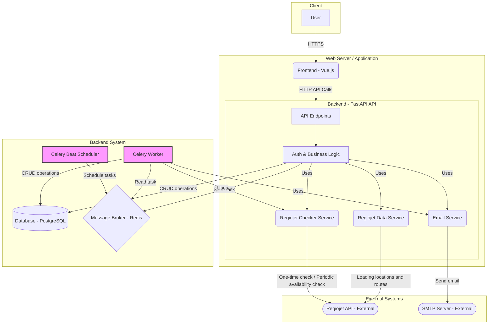

# Architecture Overview

This document provides a high-level view of the Ticket Sniper application architecture, its main components, and how they interact.

## 1. Architecture Diagram (Conceptual)

The following diagram illustrates the main system components and their relationships, including the division of responsibilities for communication with the Regiojet API:

*   **User:** Interacts with the application through a web browser.
*   **Frontend (Vue.js):** Displays the user interface, processes user inputs, and communicates with the Backend API.
*   **Backend (FastAPI):**
    *   Provides REST API for the frontend (`API Endpoints`).
    *   Processes business logic (`Auth & Business Logic`) - authentication, validation, monitoring management.
    *   Contains `Regiojet Data Service` for obtaining "static" data (list of locations, list of available routes for selection) from the Regiojet API.
    *   Contains `Regiojet Checker Service` for checking ticket availability for specific routes. This service encapsulates the logic for calling the external Regiojet API for availability checking.
    *   Communicates with the database (`Database - PostgreSQL`) for CRUD operations.
    *   Sends tasks (`Celery Worker Tasks`) to `Message Broker - Redis`.
    *   Contains `Email Service` for sending confirmation emails.
*   **Database (PostgreSQL):** Stores data about users (login credentials, verification status), unique monitored routes (identified by `regiojet_route_id`, parameters including *specific time*, status) and relationships between users and routes.
*   **Message Broker (Redis):** Serves as an intermediary for communication between FastAPI and Celery workers. Maintains task queue. Also serves for caching (e.g., location lists).
*   **Celery Beat Scheduler:** Celery component responsible for scheduling periodic tasks (e.g., launching checks of all active routes every X seconds).
*   **Celery Worker:** Background process(es) that consume tasks from Redis. Main responsibility is **calling `Regiojet Checker Service`** for periodic ticket availability checking for specific routes and launching notification tasks (via `Email Service`). **Does not call external Regiojet API directly.**
*   **Email Service (smtplib):** Component (integrated in BE and Worker) responsible for sending emails through external `SMTP Server`.
*   **Regiojet API:** External, unofficial Regiojet API. Calls to this API are encapsulated in `Regiojet Data Service` and `Regiojet Checker Service` services.
*   **SMTP Server:** External service for actual email delivery.

## 2. Basic Usage Flows

### 2.1 User Registration and Login

1.  User fills out the registration form on FE.
2.  FE sends data to BE endpoint `/auth/register`.
3.  BE validates data, creates inactive user in DB, generates confirmation token and sends confirmation email (via `Email Service`).
4.  User clicks link in email.
5.  Browser opens FE/BE endpoint page `/auth/confirm/{token}`.
6.  BE verifies token, activates user in DB.
7.  User logs in using form on FE.
8.  FE sends login credentials to BE endpoint `/auth/login`.
9.  BE verifies credentials, generates JWT token and returns it to FE.
10. FE stores token and uses it for subsequent authorized requests.

### 2.2 Starting Route Monitoring (Updated Flow)

1.  Logged-in user on FE starts filling out the monitoring form.
2.  FE (when typing in "From"/"To" fields) calls BE endpoint `GET /locations?query=...` to get suggested locations. BE returns cached data (Redis) or loads it from RJ API (`Regiojet Data Service`).
3.  User selects "From", "To" locations and "Departure Date".
4.  Once these 3 fields are filled, FE calls BE endpoint `GET /routes/available` with these parameters.
5.  BE (`Regiojet Data Service`) queries RJ API (`/routes/search/simple`) for available connections for the given day and route and returns a list of relevant data (departure/arrival times, free seats, etc.) to frontend.
6.  FE displays to user a list of available connections (times) and allows them to select a *specific departure time*.
7.  User further selects desired fares and preferred classes; if none are selected, monitoring will search for all available seats.
8.  After filling all data, user clicks "Start monitoring". FE sends *complete* data (including selected departure time) to BE endpoint `POST /routes/monitor`.
9.  BE (endpoint `/monitor`) validates data and JWT token.
10. BE performs *one-time* availability check using `Regiojet Checker Service` for the *specific* selected connection (time, classes, fares).
11. **If tickets are available:** BE returns FE message that tickets are available and monitoring does not start. Nothing is saved to DB. *(Note: This check is planned for Task 10)*
12. **If tickets are not available (or check is not yet implemented):**
    *   FE sends `regiojet_route_id` of selected connection to BE.
    *   BE (`POST /monitor`) uses `regiojet_route_id` for calling `crud.get_or_create_monitored_route`.
        *   **If it doesn't exist:** BE creates new record in `monitored_routes` with given `regiojet_route_id`, marks it as `is_active=True`.
        *   **If it exists:** Uses existing record (and possibly reactivates if it was `is_active=False`).
    *   BE creates record in `user_route_subscriptions` linking user with the given route (its `route_id`), if it doesn't already exist.
    *   BE returns FE message that monitoring was successfully started.
    *   *Note: Periodic check scheduling is handled by Celery Beat, BE does not directly launch worker for this specific request.*

### 2.3 Periodic Check and Notification

1.  **Celery Beat** periodically (e.g., every 20 seconds) launches task `schedule_route_checks`.
2.  Task `schedule_route_checks` queries DB for all routes that are `is_active=True` and whose `last_checked_at` is older than defined interval (e.g., 20s).
3.  For each such route `schedule_route_checks` updates `last_checked_at` in DB (prevention of duplicate execution) and sends to Redis task `check_single_route` with given route ID.
4.  **Celery Worker** takes task `check_single_route(route_id)` from Redis.
5.  Worker loads route details from DB using `route_id`.
6.  Worker queries Regiojet API (using `Regiojet Checker Service`) for ticket availability for given route (specific time, classes, fares).
7.  **If tickets are not available:** Task ends (may record check time).
8.  **If tickets are available:**
    *   Worker loads from DB (table `user_route_subscriptions`) emails of all users who monitor this `route_id`.
    *   For each email Worker sends to Redis task `send_notification_email` with route details and user email.
    *   Worker marks route in DB (`monitored_routes`) as `is_active=False` so it is no longer checked.
9.  **Celery Worker** takes task `send_notification_email(user_email, route_details)` from Redis.
10. Worker uses `Email Service` (`smtplib`) to send notification email to user with link to Regiojet and connection details.

## 3. Key Design Principles

*   **Separation of concerns:** Each component (FE, BE API, DB, Worker, specific services like Data/Checker/Email) has a clearly defined role.
*   **Stateless API:** FastAPI endpoints are designed as stateless, state is maintained in DB or passed via JWT.
*   **Asynchronous processing:** Resource-intensive and periodic tasks (API checking, email sending) are delegated to Celery workers to avoid blocking the main API and improve user response times.
*   **Query optimization:** One unique route (uniquely identified by `regiojet_route_id`) is checked by only one worker at a given time, regardless of the number of users monitoring it. Location fetching is cached.
*   **Scalability:** Individual components (FE, BE, Workers, DB) can be scaled independently (e.g., by adding more worker instances).
*   **Resilience:** Use of message broker and asynchronous tasks increases system resilience against failures (e.g., temporary unavailability of Regiojet API or email server).
