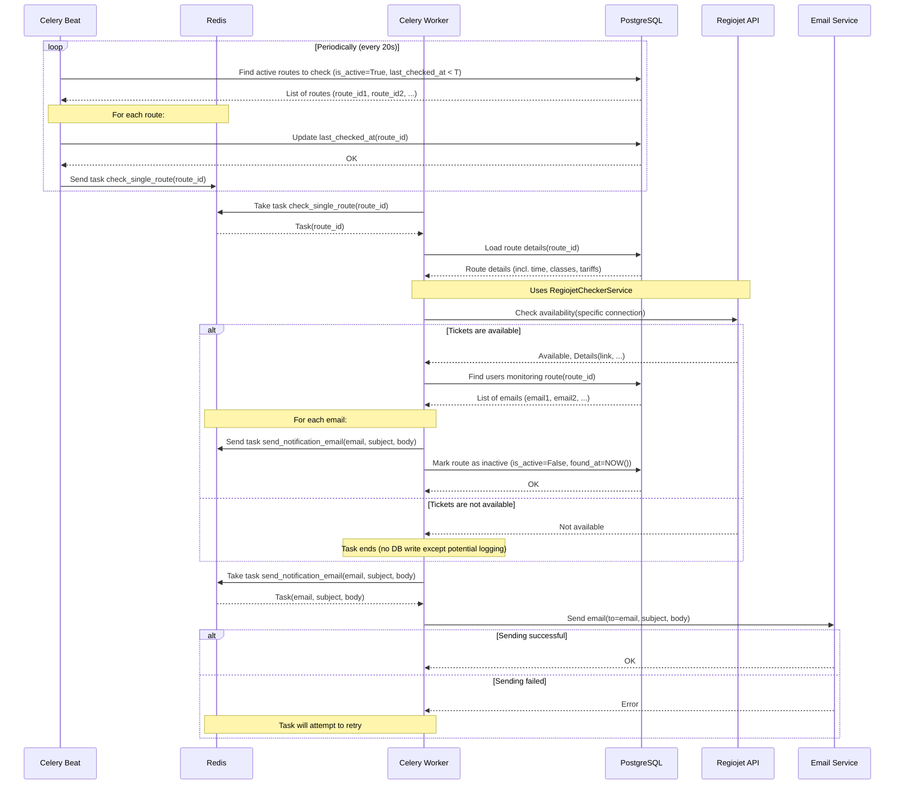

# Asynchronous Worker (Celery)

This document describes the role and implementation of the asynchronous worker using Celery for processing background tasks.

## 1. Purpose and Technologies

The asynchronous worker is responsible for tasks that should not block the main API server or that need to be executed periodically. In this application, this primarily involves:

*   Periodic querying of Regiojet API for ticket availability for *specific*, already specified connections.
*   Sending email notifications to users.

**Technologies used:**

*   **Celery:** Distributed task queue system for Python.
*   **Redis:** Message Broker (for passing tasks between API and workers) and optionally Result Backend (for storing task results when needed).
*   **Celery Beat:** Scheduler for running periodic tasks.

## 2. Celery Configuration

*   **`worker/celery_app.py`:** This is where the Celery instance is initialized.
    *   The message broker address is set (Redis URL from configuration).
    *   Optionally, the result backend is set (can also be Redis).
    *   Tasks defined in `worker/tasks.py` are imported.
    *   The schedule for Celery Beat is configured.

## 3. Task Definitions (`worker/tasks.py`)

Functions that will be executed by workers are defined here.

*   **`schedule_route_checks`**:
    *   Periodic task triggered by Celery Beat.
    *   Finds active routes that need to be checked (based on `is_active` and `last_checked_at`).
    *   For each found route, immediately updates `last_checked_at` in DB (prevents duplicate execution) and sends a `check_single_route` task to Redis with the given route ID.
*   **`check_single_route(route_id)`**:
    *   Loads details of the monitored route (`MonitoredRoute` object) from DB by `route_id`.
    *   Calls `RegiojetCheckerService` to verify ticket availability on external API for *specific time, classes and tariffs* stored in `MonitoredRoute`.
    *   **If tickets are found:**
        *   Loads emails of all users monitoring this route.
        *   For each email, sends a `send_notification_email` task to Redis.
        *   Marks the route in DB as inactive (`is_active=False`) and records the time of discovery (`found_at`).
    *   **If tickets are not found:** The task ends.
    *   Implements retry logic in case of failure (e.g., temporary API unavailability).
*   **`send_notification_email(email_to, subject, body)`**:
    *   Sends a notification email to the given user using `EmailService`.
    *   Implements retry logic in case of sending failure.

## 4. Running Workers and Scheduler

To start the system, you need to run:

1.  **Redis Server:** Must run as message broker and for caching.
2.  **Celery Worker:** Started with a terminal command that specifies the Celery application and starts the worker process.
3.  **Celery Beat Scheduler:** Started with a terminal command that specifies the Celery application and starts the scheduler (beat).

## 5. Monitoring (Optional)

For monitoring the status of tasks and workers, you can use a tool like **Flower**. It is started with a terminal command and provides a web interface.

## 6. Monitoring Sequence Diagram (Periodic Check)

