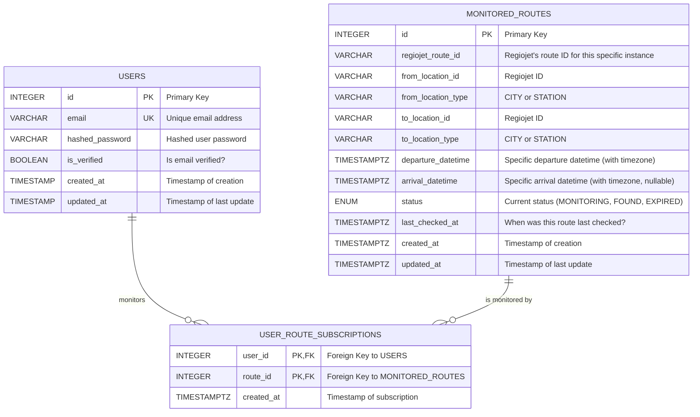

# Database Schema (PostgreSQL)

This document describes the structure of tables in the PostgreSQL database used by the application. SQLAlchemy ORM is used for database interaction.

## 1. Entity Relationship Diagram (ERD - Mermaid)

## 2. Table Descriptions

### `users`

Stores information about registered users.

*   `id` (`SERIAL PRIMARY KEY`): Unique user identifier.
*   `email` (`VARCHAR`, `UNIQUE`, `NOT NULL`): User's email address, also serves as login. Must be unique.
*   `hashed_password` (`VARCHAR`, `NOT NULL`): Securely hashed user password.
*   `is_verified` (`BOOLEAN`, `NOT NULL`, `DEFAULT FALSE`): Flag indicating whether the user has confirmed their email address.
*   `created_at` (`TIMESTAMP WITH TIME ZONE`, `NOT NULL`, `DEFAULT NOW()`): Timestamp of record creation.
*   `updated_at` (`TIMESTAMP WITH TIME ZONE`, `NOT NULL`, `DEFAULT NOW()`): Timestamp of last record update.

*Indexes:* Unique index on `email`.

### `monitored_routes`

Stores information about unique routes that are or were monitored. The goal is to have only one record for each unique combination of route parameters to optimize queries to the Regiojet API.

*   `id` (`SERIAL PRIMARY KEY`): Unique identifier of the monitored route.
*   `regiojet_route_id` (`VARCHAR`, `NOT NULL`): ID of the specific connection returned by Regiojet API. By itself, it may not be unique in this table.
*   `from_location_id` (`VARCHAR`, `NOT NULL`): ID of the source location (according to Regiojet API).
*   `from_location_type` (`VARCHAR`, `NOT NULL`): Type of source location ('CITY' or 'STATION').
*   `to_location_id` (`VARCHAR`, `NOT NULL`): ID of the destination location (according to Regiojet API).
*   `to_location_type` (`VARCHAR`, `NOT NULL`): Type of destination location ('CITY' or 'STATION').
*   `departure_datetime` (`TIMESTAMP WITH TIME ZONE`, `NOT NULL`): **Specific date and time of departure of the connection selected by the user.** Used for monitoring expiration checks.
*   `arrival_datetime` (`TIMESTAMP WITH TIME ZONE`, `NULL`): Specific date and time of connection arrival.
*   `status` (`ENUM('MONITORING', 'FOUND', 'EXPIRED')`, `NOT NULL`, `DEFAULT 'MONITORING'`): Current monitoring status of the route. `MONITORING`: actively monitored; `FOUND`: tickets were found; `EXPIRED`: connection departed or expired without finding tickets.
*   `last_checked_at` (`TIMESTAMP WITH TIME ZONE`, `NULL`): Time of last availability check by worker.
*   `created_at` (`TIMESTAMP WITH TIME ZONE`, `NOT NULL`, `DEFAULT NOW()`): Timestamp of record creation.
*   `updated_at` (`TIMESTAMP WITH TIME ZONE`, `NOT NULL`, `DEFAULT NOW()`): Timestamp of last record update.

*Indexes:* Combined unique index on (`regiojet_route_id`, `from_location_id`, `to_location_id`). Index on `status` and `departure_datetime` (for efficient worker queries on active and non-expired routes).

### `user_route_subscriptions`

Junction table (many-to-many) between users and monitored routes. Records which user wants to be notified about which route.

*   `user_id` (`INTEGER`, `NOT NULL`, `REFERENCES users(id) ON DELETE CASCADE`): Foreign key to the `users` table.
*   `route_id` (`INTEGER`, `NOT NULL`, `REFERENCES monitored_routes(id) ON DELETE CASCADE`): Foreign key to the `monitored_routes` table.
*   `created_at` (`TIMESTAMP WITH TIME ZONE`, `NOT NULL`, `DEFAULT NOW()`): Time when the user added the route for monitoring.
*   `PRIMARY KEY` (`user_id`, `route_id`): Combined primary key ensures that one user can monitor one route only once.

*Indexes:* Primary key (`user_id`, `route_id`). Index on `route_id` for fast finding of all users monitoring a given route.

## 3. Notes

*   The combination (`regiojet_route_id`, `from_location_id`, `to_location_id`) is key for unique identification of a unique monitored route in our application and for optimization. This data is obtained from Regiojet API when the user selects a connection.
*   `ON DELETE CASCADE` on foreign keys in `user_route_subscriptions` ensures automatic deletion of subscriptions if a user or monitored route is deleted (although routes should rather not be deleted, just deactivated).
*   Timestamps (`created_at`, `updated_at`) help with auditing and debugging.
*   For production deployment, consider using a database migration management tool such as `Alembic`.
